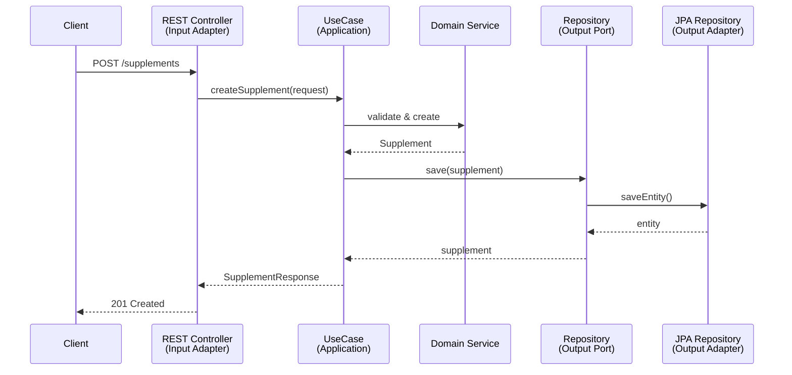

# Hexagonal Architecture Guide

This document describes the folder structure and design decisions for implementing **Hexagonal Architecture** (also known as Ports and Adapters) in this Spring Boot project.

---

## Architecture Overview

```
┌──────────────────────────────────────────────────────────────────────┐
│                         ADAPTERS (Input)                             │
│   ┌─────────────┐    ┌─────────────┐                                 │
│   │  REST API   │    │    CLI      │                                 │
│   └──────┬──────┘    └──────┬──────┘                                 │
│          │                  │                                        │
│          ▼                  ▼                                        │
│   ┌─────────────────────────────────────────────────────────────┐    │
│   │                    INPUT PORTS                               │    │
│   │              (Use Case Interfaces)                           │    │
│   └──────────────────────────┬──────────────────────────────────┘    │
│                              │                                        │
│   ┌──────────────────────────▼──────────────────────────────────┐    │
│   │                      APPLICATION                             │    │
│   │           (Use Case Implementations)                         │    │
│   └──────────────────────────┬──────────────────────────────────┘    │
│                              │                                        │
│   ┌──────────────────────────▼──────────────────────────────────┐    │
│   │                        DOMAIN                                │    │
│   │        (Entities, Value Objects, Domain Services)           │    │
│   └──────────────────────────┬──────────────────────────────────┘    │
│                              │                                        │
│   ┌──────────────────────────▼──────────────────────────────────┐    │
│   │                    OUTPUT PORTS                              │    │
│   │            (Repository Interfaces)                           │    │
│   └──────────────────────────┬──────────────────────────────────┘    │
│                              │                                        │
│          ┌───────────────────┼───────────────────┐                   │
│          ▼                   ▼                   ▼                   │
│   ┌─────────────┐    ┌─────────────┐    ┌─────────────┐              │
│   │  Database   │    │  External   │    │  Messaging  │              │
│   │  Adapter    │    │  API        │    │  Adapter    │              │
│   └─────────────┘    └─────────────┘    └─────────────┘              │
│                         ADAPTERS (Output)                            │
└──────────────────────────────────────────────────────────────────────┘
```

---

## Folder Structure

```
src/main/java/com/BmoGlitchCode/supplemint/
├── domain/                          # 🔵 Core Business Logic (innermost layer)
│   ├── model/                       # Entities & Value Objects
│   ├── port/
│   │   ├── input/                   # Input Ports (Use Case Interfaces)
│   │   └── output/                  # Output Ports (Repository Interfaces)
│   └── service/                     # Domain Services
│
├── application/                     # 🟢 Application Layer
│   ├── usecase/                     # Use Case Implementations
│   ├── dto/
│   │   ├── request/                 # Input DTOs
│   │   └── response/                # Output DTOs
│   └── mapper/                      # DTO <-> Domain Mappers
│
├── adapter/                         # 🟠 Adapters Layer (outermost layer)
│   ├── input/                       # Driving Adapters
│   │   ├── rest/                    # REST Controllers
│   │   └── cli/                     # CLI Commands (optional)
│   └── output/                      # Driven Adapters
│       ├── persistence/             # Database Implementation
│       │   ├── entity/              # JPA Entities
│       │   ├── repository/          # Spring Data Repositories
│       │   └── mapper/              # Entity <-> Domain Mappers
│       └── external/                # External Service Clients
│
└── infrastructure/                  # ⚙️ Infrastructure & Configuration
    └── config/                      # Spring Configuration Classes
```

---

## Layer Descriptions

### 🔵 Domain Layer (`domain/`)

The **innermost layer** containing pure business logic with **no framework dependencies**.

| Package | Purpose | Examples |
|---------|---------|----------|
| `model/` | Core business entities and value objects | `Supplement.java`, `Dosage.java`, `SupplementId.java` |
| `port/input/` | Interfaces defining use cases | `CreateSupplementUseCase.java` |
| `port/output/` | Interfaces for external dependencies | `SupplementRepository.java` |
| `service/` | Domain services for cross-entity logic | `SupplementValidator.java` |

> [!IMPORTANT]
> The domain layer must have **zero dependencies** on Spring or any external frameworks.

---

### 🟢 Application Layer (`application/`)

Orchestrates use cases by coordinating domain objects and ports.

| Package | Purpose | Examples |
|---------|---------|----------|
| `usecase/` | Implements input ports | `CreateSupplementUseCaseImpl.java` |
| `dto/request/` | Data transfer objects for input | `CreateSupplementRequest.java` |
| `dto/response/` | Data transfer objects for output | `SupplementResponse.java` |
| `mapper/` | Maps between DTOs and domain models | `SupplementDtoMapper.java` |

---

### 🟠 Adapter Layer (`adapter/`)

Connects the application to the outside world.

#### Input Adapters (Driving)

| Package | Purpose | Examples |
|---------|---------|----------|
| `input/rest/` | REST API controllers | `SupplementController.java` |
| `input/cli/` | Command-line interfaces | `ImportSupplementCommand.java` |

#### Output Adapters (Driven)

| Package | Purpose | Examples |
|---------|---------|----------|
| `output/persistence/entity/` | JPA entities | `SupplementEntity.java` |
| `output/persistence/repository/` | Spring Data repos | `JpaSupplementRepository.java` |
| `output/persistence/mapper/` | Entity mappers | `SupplementEntityMapper.java` |
| `output/external/` | External API clients | `NutritionApiClient.java` |

---

### ⚙️ Infrastructure Layer (`infrastructure/`)

Cross-cutting concerns and Spring configuration.

| Package | Purpose | Examples |
|---------|---------|----------|
| `config/` | Spring configuration | `SecurityConfig.java`, `BeanConfig.java` |

---

## Dependency Rule

```
Adapters → Application → Domain ← Adapters (via Ports)
```

> [!CAUTION]
> Inner layers must **never** depend on outer layers. The domain knows nothing about Spring, JPA, or REST.

---

## Key Principles

1. **Ports define contracts** - Input ports declare what the application can do; output ports declare what it needs
2. **Adapters implement ports** - Input adapters call ports; output adapters implement them
3. **Domain is technology-agnostic** - No `@Entity`, `@Service`, or framework annotations in domain
4. **Dependency Injection wires it together** - Spring connects adapters to ports at runtime

---

## Example Flow



---

## Test Structure

```
src/test/java/com/BmoGlitchCode/supplemint/
├── domain/
│   └── service/                 # Unit tests for domain logic
├── application/
│   └── usecase/                 # Unit tests for use cases (mocked ports)
└── adapter/
    ├── input/
    │   └── rest/                # Integration tests for controllers
    └── output/
        └── persistence/         # Integration tests for repositories
```

---

## Quick Reference

| Layer | Depends On | Contains |
|-------|------------|----------|
| **Domain** | Nothing | Entities, Value Objects, Domain Services, Ports |
| **Application** | Domain | Use Cases, DTOs, Mappers |
| **Adapter** | Application, Domain | Controllers, Repositories, External Clients |
| **Infrastructure** | All | Spring Config, Cross-cutting concerns |
